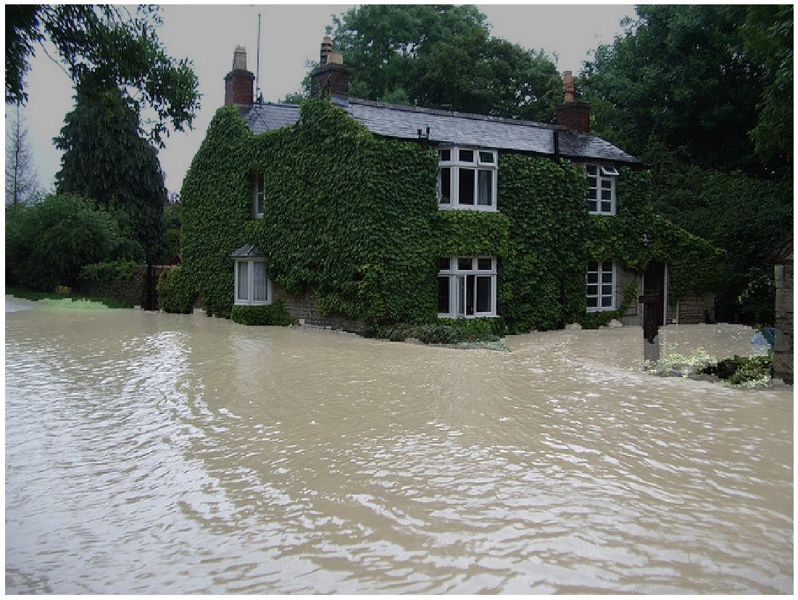

# DeepLab To Segment water in flood images <!-- omit in toc --> 

This is an unofficial **PyTorch** modification of **DeepLab v2** with a **ResNet-101** backbone. Most of the code has been taken from this repository: [kazuto1011/deeplab-pytorch](https://github.com/kazuto1011/deeplab-pytorch)

We use their model trained on **COCO-Stuff 164K** dataset and merged some [labels](https://github.com/nightrome/cocostuff/blob/master/labels.md) to output a binary mask of water.

Merged labels: 

- water-other
- river
- sand
- sea

## Performance
Quantifying the performance on 210 flood images annotated manually the model achieve a good IOU of **IOU = 0.786** (without crf) 
Looking at the results individually we remark that most of them are either well segmented or very badly (in the case of when the algorithm recognize the road under the flood and label it as 'road'. With a simple post processing where the user remove all images with less than 50 % of the flood identified, one may reach **IOU = 0.861** (without crf)

Here is an example of a good segmentation. 



CRF should increase the performance but is slower at inference time (9s/it vs several it/s).

## Pretrained Model

Pretrained model is provided here: [
deeplabv2_resnet101_msc-cocostuff164k](https://drive.google.com/file/d/18kR928yl9Hz4xxuxnYgg7Hpi36hM8J2d/view)


### Requirements

* Python 2.7+/3.6+
* Anaconda environement

Then setup from `conda_env.yaml`. Please modify cuda option as needed (default: `cudatoolkit=10.0`)

```console
$ conda env create -f configs/conda_env.yaml
$ conda activate deeplab-pytorch
```

## How to use ?

### Single image

```
Usage: demo.py single [OPTIONS]

  Inference from a single image

Options:
  -c, --config-path FILENAME  Dataset configuration file in YAML  [required]
  -m, --model-path PATH       PyTorch model to be loaded  [required]
  -i, --image-path PATH       Image to be processed  [required]
  --cuda / --cpu              Enable CUDA if available [default: --cuda]
  --crf                       CRF post-processing  [default: False]
  --help                      Show this message and exit.
```

### Several images

```
Usage: demo.py test [OPTIONS]

  Inference from a single folder

Options:
  -c, --config-path FILENAME  Dataset configuration file in YAML  [required]
  -m, --model-path PATH       PyTorch model to be loaded  [required]
  -i, --folder-path PATH      Folder of images to be processed  [required]
  -o, --output-path PATH      Folder to store results [required]
  --cuda / --cpu              Enable CUDA if available [default: --cuda]
  --crf                       CRF post-processing  [default: False]
  --help                      Show this message and exit.
```

Example: 

``` 
python demo.py test -c ./configs/cocostuff164k.yaml -m ./deeplabv2_resnet101_msc-cocostuff164k-100000.pth -i ./Dataset/flood_dataset/ -o ./output/predicted_crf/ --crf 
```

## References

1. L.-C. Chen, G. Papandreou, I. Kokkinos, K. Murphy, A. L. Yuille. DeepLab: Semantic Image
Segmentation with Deep Convolutional Nets, Atrous Convolution, and Fully Connected CRFs. *IEEE TPAMI*,
2018.<br>
[Project](http://liangchiehchen.com/projects/DeepLab.html) /
[Code](https://bitbucket.org/aquariusjay/deeplab-public-ver2) / [arXiv
paper](https://arxiv.org/abs/1606.00915)

2. H. Caesar, J. Uijlings, V. Ferrari. COCO-Stuff: Thing and Stuff Classes in Context. In *CVPR*, 2018.<br>
[Project](https://github.com/nightrome/cocostuff) / [arXiv paper](https://arxiv.org/abs/1612.03716)

1. M. Everingham, L. Van Gool, C. K. I. Williams, J. Winn, A. Zisserman. The PASCAL Visual Object
Classes (VOC) Challenge. *IJCV*, 2010.<br>
[Project](http://host.robots.ox.ac.uk/pascal/VOC) /
[Paper](http://host.robots.ox.ac.uk/pascal/VOC/pubs/everingham10.pdf)
